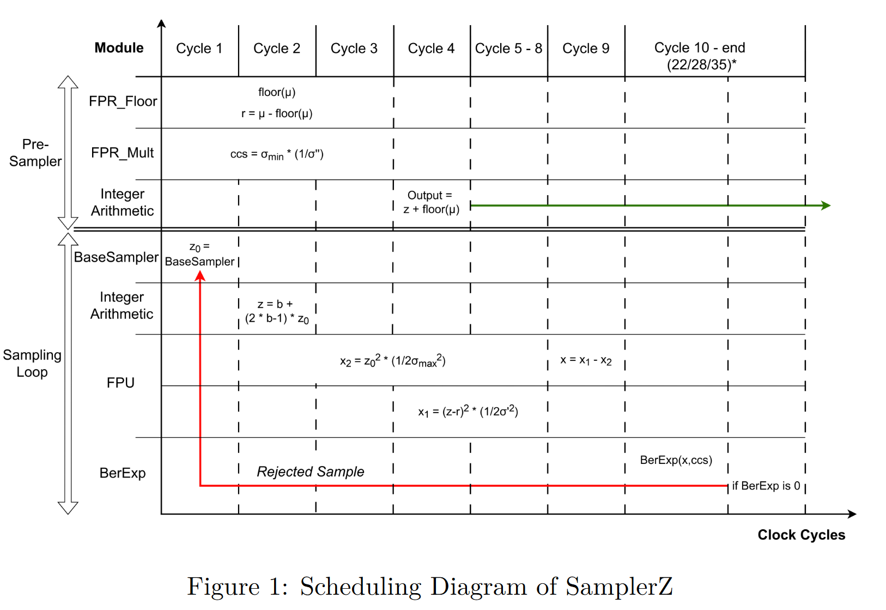
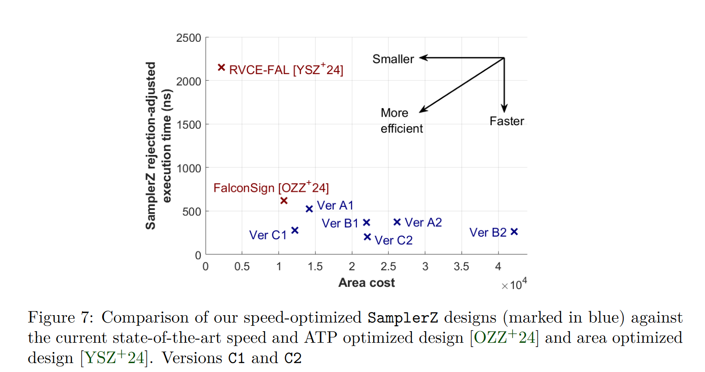
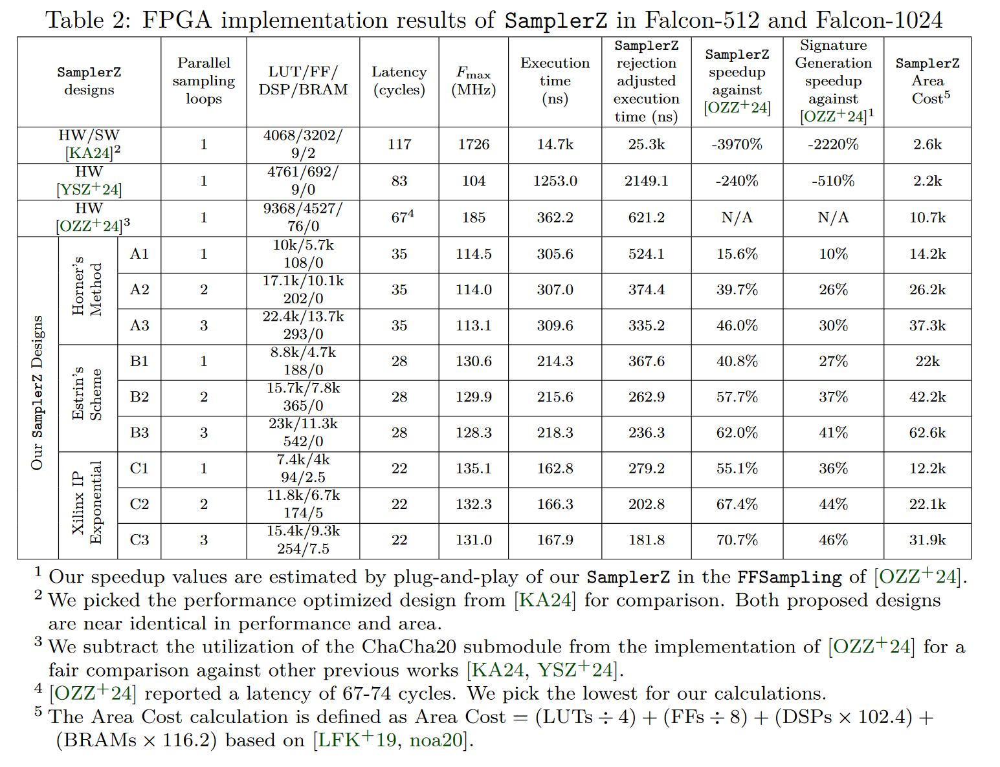
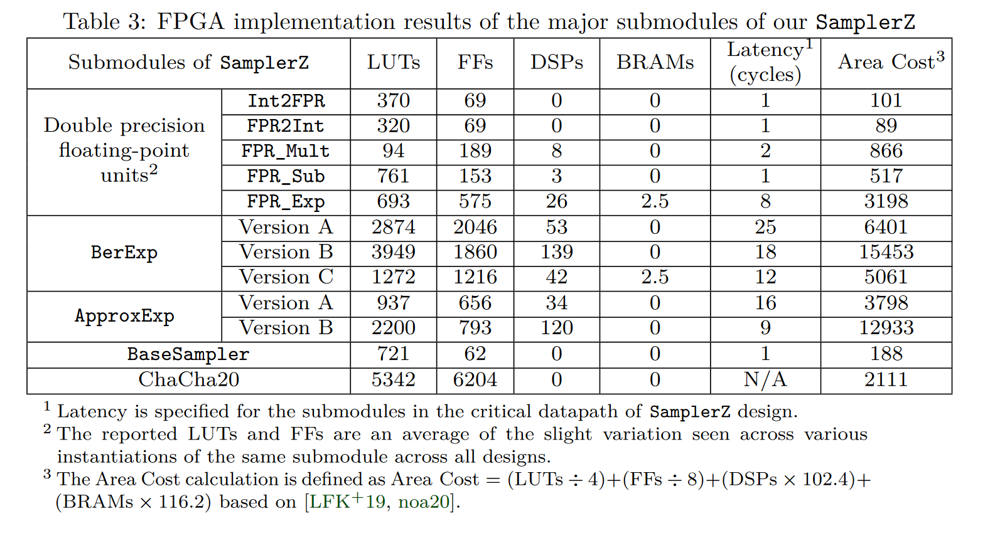

# Outrunning the Millennium FALCON: Speed Records for FALCON on FPGAs
Anonymous submission for TCHES 2026.

Scroll below for key figures and IP configurations.

# Key figures and tables

  

---

  

---

  

---

  

# IP Configurations

## double_to_int_lat_01

- Operation: Float-to-fixed
- Input Precision: Double precision floating point
- Output Precision: 64b integer, 0b fractional
- Optimization
  - DSP Slice Usage: No usage
- Interface:
  - Flow Control: Blocking
  - Optimize Goal: Performance
  - Result TREADY: No
  - Latency: 1

## int_to_double_lat_01

- Operation: Fixed-to-float
- Input Precision: 64b integer, 0b fractional
- Output Precision: Double precision floating point
- Optimization
  - DSP Slice Usage: No usage
- Interface:
  - Flow Control: Blocking
  - Optimize Goal: Performance
  - Result TREADY: No
  - Latency: 1

## double_mult_optspeed_latency_02

- Operation: Multiply
- Input Precision: Double precision floating point
- Optimization
  - Architecture: High Speed
  - DSP Slice Usage: Max
- Interface:
  - Flow Control: Blocking
  - Optimize Goal: Performance
  - Result TREADY: No
  - Latency: 2

## double_mult_optspeed_latency_03

- Operation: Multiply
- Input Precision: Double precision floating point
- Optimization
  - Architecture: High Speed
  - DSP Slice Usage: Max
- Interface:
  - Flow Control: Blocking
  - Optimize Goal: Performance
  - Result TREADY: No
  - Latency: 3

## double_sub_latency_01_nb

- Operation: Subtract
- Input Precision: Double precision floating point
- Optimization
  - Architecture: High Speed
  - DSP Slice Usage: Full usage
- Interface:
  - Flow Control: Non-blocking
  - Optimize Goal: Resources
  - Latency: 1

## fpr_exp_latency_08

- Operation: Exponential
- Input Precision: Double precision floating point
- Optimization
  - Architecture: High Speed
  - DSP Slice Usage: Full usage
  - BRAM Usage: Full usage
- Interface:
  - Flow Control: Blocking
  - Optimize Goal: Performance
  - Result TREADY: No
  - Latency: 8

---
